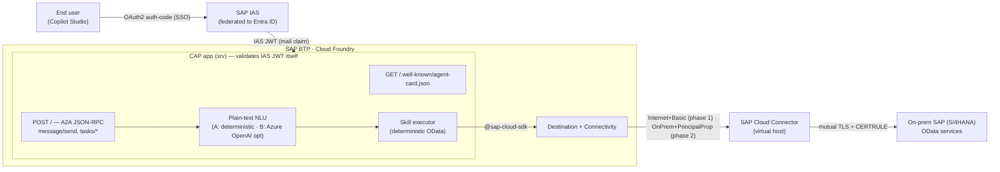

# 01 · Architecture

The A2A CAP agent is a **CAP Node.js app** on **Cloud Foundry** that speaks the **A2A protocol** to Microsoft Copilot Studio on the front, and calls **on-premise SAP OData services** through a **BTP Destination + Cloud Connector** on the back. It reuses — unchanged — the **SSO identity chain** established in Parts 3–4.

## Component view



ASCII form (matching the series' style):

```
Copilot Studio ─▶ CAP A2A app (validates IAS JWT) ─▶ Destination ─▶ Cloud Connector ─▶ on-prem SAP
  (end user)        reads `mail`, NLU + skill          Internet+Basic   (phase 2: mints        ICM (mutual TLS)
   SSO via IAS       executor over OData V2             (phase 1)        per-user X.509 cert)   + CERTRULE → real ABAP user
```

## Endpoints the CAP app exposes

| Method | Path | Purpose |
|---|---|---|
| `GET` | `/.well-known/agent-card.json` | The **A2A Agent Card** — name, URL, capabilities, security scheme, and the **skills** Copilot Studio can call |
| `POST` | `/` | The **A2A JSON-RPC** endpoint — `message/send`, `message/stream`, `tasks/get`, `tasks/cancel` |
| `GET` | `/health` (optional) | Liveness probe for CF health checks and monitoring |

These are mounted into CAP's Express app during `cds.on("bootstrap")`, using the `@a2a-js/sdk` Express handlers (`agentCardHandler`, `jsonRpcHandler`). A placeholder `service dummy {}` in `srv/service.cds` ensures CAP starts an Express app to hook into. See [`05-project-structure.md`](./05-project-structure.md).

## Request flow (one read-only skill)

1. **User asks** Copilot Studio a question that maps to an agent skill (e.g. *"What's the status of sales order 12345?"*).
2. Copilot Studio calls the agent's **A2A JSON-RPC** endpoint with `message/send`, attaching the **IAS bearer JWT** obtained by SSO (OAuth2 auth-code against IAS, federated to Entra). The question travels as a **plain text part**.
3. The CAP app validates the IAS JWT itself (**CAP-native IAS**, `srv/a2a/auth.js` against the bound `identity` service — no App Router / XSUAA) and reads the **`email`/`mail`** claim.
4. The **executor** resolves the message to `(skill id, params)` — using the plain-text **NLU** (`srv/a2a/nlu.js`: deterministic option A, optional Azure OpenAI option B) when no structured DataPart is present — then issues a backend **OData V2** call via `executeHttpRequest({ destinationName })`.
5. The **Destination** + **Connectivity** route the call to the backend. *Phase 1* uses a `pm4-ssl` destination with Proxy Type `Internet` + `BasicAuthentication` (technical user). *Phase 2* flips the **same** destination to `OnPremise` + `PrincipalPropagation` through the **Cloud Connector**, which mints a per-user X.509 cert (subject = the user's `mail`) that **CERTRULE** maps to the real ABAP user — no code change, only `PRINCIPAL_PROPAGATION=true` (see [`07-next-steps.md`](./07-next-steps.md)).
6. The OData response is unwrapped and **shaped into the artifact's text part as a Markdown table** (arrays) or bullet list (single record), with `/Date(ms)/` → `YYYY-MM-DD` and `__metadata` stripped; the raw records ride along as a structured `data` part. The task is marked **completed** on the event bus and Copilot Studio renders the answer.

The identity half is the same SSO chain as [Part 4](https://github.com/hobru/sap-mcp-gateway-copilot-studio/blob/main/guides/04-principal-propagation.md); only the runtime in the middle changes (CAP app instead of MCP Gateway) and inbound validation is CAP-native rather than via App Router.

## Inbound authentication (SSO)

- Copilot Studio authenticates with **OAuth2 authorization-code** against **IAS** (Entra federated in), exactly like the custom connectors in Parts 2–3 — this is the "BTP Router App" SSO pattern.
- The Agent Card advertises this via a **`securitySchemes`** entry (OAuth2, authorization-code, IAS `authorize`/`token` URLs) and a top-level **`security`** requirement, so Copilot Studio knows how to obtain a token. See [`04-agent-card-and-skills.md`](./04-agent-card-and-skills.md).
- Inbound token validation is **CAP-native**: the app validates the IAS JWT itself via `srv/a2a/auth.js` against the bound `identity` service (`aud` must equal the app clientid). There is **no App Router and no XSUAA** — this keeps the deployment to a single module. See [`GETTING-STARTED.md`](../GETTING-STARTED.md) Section 6.

## Outbound authentication (backend)

- A single **OnPremise** destination with `Authentication = PrincipalPropagation`, pointing at the Cloud Connector **virtual host** — reused from Part 4. Details and per-service base paths in [`03-destination-and-connectivity.md`](./03-destination-and-connectivity.md).
- Calls go out via the **SAP Cloud SDK** (`@sap-cloud-sdk/http-client` + `@sap-cloud-sdk/connectivity`), which resolves the destination and tunnels through the Connectivity service transparently.

## Where orchestration lives

Two layers, kept deliberately separate:

- **Reasoning / planning → Copilot Studio.** The LLM that decides *which* skills to call and *how to phrase* the answer stays in Copilot Studio. The CAP agent exposes clear, well-described skills and Copilot Studio composes them.
- **Deterministic execution → CAP app.** Each skill is a **deterministic** mapping from `(skill id, parameters)` to one or more OData calls. A skill *may* fan out to several OData services (e.g. enrich a sales order with business-partner details) — that composition is hand-written and predictable, not model-driven.

**Plain-text NLU (shipped):** because Copilot Studio sends the user's question as free text, the executor resolves it to `(skill id, params)` with a lightweight NLU in `srv/a2a/nlu.js`. **Option A (default)** is fully deterministic — keyword/tag scoring against the agent-card skills plus regex parameter extraction; no model, no network, no key. **Option B (optional)** sends the text + skill catalog to **Azure OpenAI** for `{skill, params}` JSON and falls back to option A on any error; enable it only by setting the `AZURE_OPENAI_*` env vars (see [`GETTING-STARTED.md`](../GETTING-STARTED.md) Section 6.1).

**Optional server-side orchestration (only if needed):** if a single skill must plan across many services from a free-text instruction, the same Azure OpenAI path can be extended into a planner **inside** the CAP app — reached over HTTPS (optionally via a BTP destination holding the Azure endpoint + key). This remains an optional phase (see [`07-next-steps.md`](./07-next-steps.md)); the default design needs no model on the BTP side at all.

## Non-goals for the first iteration

- No write / action skills (create/change OData `POST`/`PATCH`) — read-only first.
- No server-side LLM — Copilot Studio reasons; CAP executes.
- No push notifications / long-running task callbacks beyond the SDK's in-memory task store.
