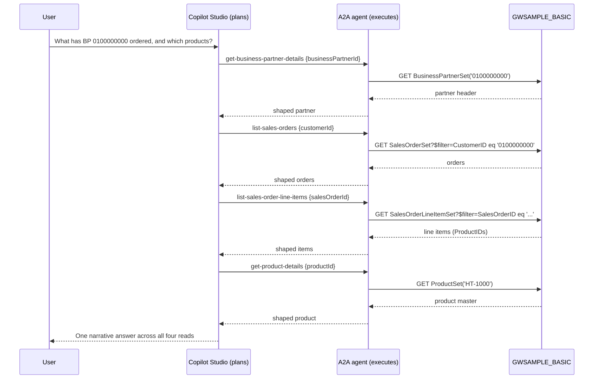

# Tutorial — build your own A2A CAP agent over YOUR OData services

This is the hands-on tutorial for **project 02** of the
[SAP A2A Agents for Microsoft Copilot Studio](../README.md) series. You will take
the **same deterministic engine** that powers the fully-worked
[`01-a2a-cap-agent/`](../01-a2a-cap-agent/) and point it at **your own** SAP OData
services — adding skills in **YAML only, no JavaScript**.

By the end you will have a running A2A agent that:

- publishes an **Agent Card** at `/.well-known/agent-card.json`,
- executes **read-only** OData V2 reads (`getByKey` / `list`) against your gateway,
- stays **deterministic** — all reasoning and multi-step orchestration lives in
  **Microsoft Copilot Studio**, and
- ships with **8 demo skills** over the public SAP sample services so you can run
  the whole thing before you touch your own backend.

> **Ground rules (never broken).** The CAP app is a read-only OData executor — only
> `getByKey` and `list`, never a write or an action. OData **V2** only. If you ever
> want server-side reasoning it is **Azure OpenAI** (opt-in, env-gated). Copilot
> Studio is the brain; this agent is the deterministic hands.

New to the pattern? Skim [`01`'s README](../01-a2a-cap-agent/README.md) for the
architecture and identity chain first — this tutorial reuses all of it and focuses
on *authoring your own content*.

---

## Table of contents

1. [What you'll build](#1-what-youll-build)
2. [Prerequisites](#2-prerequisites)
3. [Get the engine running in 5 minutes](#3-get-the-engine-running-in-5-minutes)
4. [Configure the destination (Cloud Connector + BTP)](#4-configure-the-destination-cloud-connector--btp)
5. [Anatomy of a skill YAML](#5-anatomy-of-a-skill-yaml)
6. [Add your own skill with `npm run create:skill`](#6-add-your-own-skill-with-npm-run-createskill)
7. [Orchestration I — deep chaining inside ONE service](#7-orchestration-i--deep-chaining-inside-one-service)
8. [Add a second backend (RMTSAMPLEFLIGHT)](#8-add-a-second-backend-rmtsampleflight)
9. [Orchestration II — multi-backend routing & cross-service](#9-orchestration-ii--multi-backend-routing--cross-service)
10. [Deploy to Cloud Foundry & connect Copilot Studio](#10-deploy-to-cloud-foundry--connect-copilot-studio)

---

## 1. What you'll build

An **Agent-to-Agent (A2A)** agent that exposes a curated slice of *your* SAP
system to **Microsoft Copilot Studio** as a set of named skills. Copilot Studio
does the language understanding, planning, and multi-step composition; your agent
receives a resolved `{ skill, params }`, builds a precise OData V2 URL, calls your
gateway through a **BTP destination + SAP Cloud Connector**, shapes the response,
and returns it. Nothing more.

```
  Microsoft Copilot Studio            this agent (SAP CAP, Node.js)            your SAP backend
 ┌───────────────────────┐    A2A    ┌──────────────────────────────┐  OData ┌────────────────┐
 │ LLM: understand, plan │──────────▶│ registry → NLU/DataPart →     │───V2──▶│ /sap/opu/odata │
 │ chain skills, format  │◀──────────│ params → OData URL → shape    │◀───────│  gateway       │
 └───────────────────────┘           └──────────────────────────────┘        └────────────────┘
     the reasoning layer               deterministic, read-only executor        GWSAMPLE / yours
```

**Why this split?** Determinism, auditability, and least privilege. Every call the
agent can make is declared in a YAML file you can review; there is no prompt that
can make it write, delete, or read an entity set you did not expose. The
intelligence is entirely in Copilot Studio, where it belongs.

The demo skills that ship in this template read the public **SAP Gateway sample
services**:

| # | Skill | Service | Op | Reads |
|---|-------|---------|----|-------|
| 1 | `get-business-partner-details` | GWSAMPLE_BASIC | getByKey | one business partner |
| 2 | `list-products` | GWSAMPLE_BASIC | list | products (opt. by category) |
| 3 | `get-product-details` | GWSAMPLE_BASIC | getByKey | one product |
| 4 | `list-sales-orders` | GWSAMPLE_BASIC | list | sales orders (opt. by customer) |
| 5 | `get-sales-order-details` | GWSAMPLE_BASIC | getByKey | one sales-order header |
| 6 | `list-sales-order-line-items` | GWSAMPLE_BASIC | list | line items of one order |
| 7 | `list-flights` | RMTSAMPLEFLIGHT | list | flights (opt. by carrier/city) |
| 8 | `get-flight-details` | RMTSAMPLEFLIGHT | getByKey | one flight (composite key) |

Skills 1–6 let you demonstrate **deep chaining inside one service** (Section 7);
adding service 7–8 shows **one agent fronting two independent backends**
(Sections 8–9).

> ⚠️ **Verify-TODO for flights.** The GWSAMPLE_BASIC entity/property names are
> standard and stable. The **RMTSAMPLEFLIGHT** names in skills 7–8
> (`FlightCollection`, `carrid`, `connid`, `fldate`, `cityFrom`, `cityTo`,
> `airportFrom`, `airportTo`, `PRICE`, `CURRENCY`, `PLANETYPE`, `SEATSMAX`,
> `SEATSOCC`) could not be verified against a live `$metadata` while authoring this
> template. Before you rely on them, open
> `…/RMTSAMPLEFLIGHT/$metadata` on your gateway and confirm the exact casing — then
> fix the two YAML files. Both flight skills carry the same inline note.

---

## 2. Prerequisites

### Tooling (local)

- **Node 20+** and the CAP dev kit: `npm i -g @sap/cds-dk` (then `cds -v` prints a
  cds-dk version).
- For deploy: the **`cf` CLI** (Cloud Foundry) and **`mbt`** (Cloud MTA Build Tool).
- Windows is assumed throughout (PowerShell examples). macOS/Linux users: swap
  backslashes for forward slashes and `Copy-Item` for `cp`.

### SAP backend — activate the sample services

The demo skills read two OData V2 services that ship with every SAP Gateway system
but are usually **inactive**. Activate them in transaction **`/IWFND/MAINT_SERVICE`**
(*Activate and Maintain Services* → *Add Service*), or ask Basis to:

| Service (external name) | Namespace | Used by skills |
|---|---|---|
| `GWSAMPLE_BASIC` | `IWBEP` | 1–6 |
| `RMTSAMPLEFLIGHT` | `IWBEP` (optional) | 7–8 |

Confirm each is reachable in a browser/`$metadata` check:

```
https://<your-gateway-host>/sap/opu/odata/IWBEP/GWSAMPLE_BASIC/$metadata
https://<your-gateway-host>/sap/opu/odata/IWBEP/RMTSAMPLEFLIGHT/$metadata
```

Note the **`/IWBEP/`** segment — not `/sap/`. That path difference is the single
most common gotcha in this whole tutorial; Section 5 shows how the `namespace`
field handles it.

### BTP & connectivity (for deploy, Section 10)

- A **BTP subaccount** with **Cloud Foundry** enabled and entitlements for
  `identity` (plan `application`), `destination` (lite), `connectivity` (lite), and
  `application-logs` (lite).
- **SAP Cloud Connector** installed and paired to that subaccount, exposing your
  gateway host as a virtual host.
- A **BTP destination** pointing at the gateway (Section 4).
- **Microsoft Copilot Studio** access to register the agent (Section 10).

You can complete Sections 3–7 **entirely locally** with no BTP, Cloud Connector, or
Copilot Studio — the engine runs against mocked auth and an in-memory database, and
the Agent Card is fully browsable. You only need BTP once you want a real backend
call.

---

## 3. Get the engine running in 5 minutes

```powershell
cd 02-a2a-cap-template
npm install                      # first run resolves @sap/cds etc.
Copy-Item .env.example .env      # local dev only; .env is gitignored — never commit it
npm run start                    # cds-serve: compiles + deploys in-memory sqlite, then listens
```

First boot takes ~1–2 minutes (it compiles the model and deploys an in-memory
sqlite). Wait for:

```
[a2a] Agent "SAP Backend Agent" ready with 8 skill(s); card at /.well-known/agent-card.json
```

> **Offline?** `npm install` needs network the first time to fetch dependencies. If
> your machine is fully air-gapped, run it once where you have access and copy
> `node_modules/` over. The runtime itself needs no network for local dev — it never
> calls SAP until you bind a destination.

### See your 8 skills

Open the Agent Card in a browser or curl it:

```powershell
curl.exe http://localhost:4004/.well-known/agent-card.json
```

You'll get a JSON document whose `skills[]` array has **8 entries** — one per YAML
file in `srv/a2a/skills/`. There's also a public health probe:

```powershell
curl.exe http://localhost:4004/health
# {"status":"ok","skills":8}
```

### Verify locally without leaving the terminal

Three scripts let you validate and explore without a browser:

```powershell
npm run validate:skills   # schema-checks every YAML → "OK: 8 skill file(s) valid, 8 unique id(s)."
npm run list:skills       # prints id, operation, service and entity set for each skill
npm run test:nlu          # runs the offline NLU harness (deterministic routing)
```

`validate:skills` runs at startup too, so a broken YAML fails fast with a precise
message. Keep it green.

### What a call looks like (optional, local)

Copilot Studio sends the **user's sentence** as a text part; the agent's
deterministic NLU (`srv/a2a/nlu.js`) routes it to a skill. Locally the
`x-dev-email` header stands in for the IAS principal. Write the body to a file
(PowerShell mangles inline JSON):

```powershell
@'
{
  "jsonrpc": "2.0",
  "id": "1",
  "method": "message/send",
  "params": {
    "message": {
      "kind": "message",
      "role": "user",
      "messageId": "m1",
      "parts": [
        { "kind": "data", "data": { "skill": "get-product-details", "params": { "productId": "HT-1000" } } }
      ]
    }
  }
}
'@ | Out-File -Encoding ascii body.json

curl.exe -s -X POST http://localhost:4004/ `
  -H "content-type: application/json" `
  -H "x-dev-email: dev.user@example.com" `
  --data "@body.json"
```

Without a bound destination this runs the full path (auth → skill lookup → param
validation → URL build) and then fails at the **destination lookup** — that is
expected locally. Bind a destination (Section 4) or deploy (Section 10) and the same
call returns the shaped OData record.

Stop the server with `Ctrl+C` when you're done.

---

## 4. Configure the destination (Cloud Connector + BTP)

The agent never holds backend credentials. Outbound auth is entirely a **BTP
destination** the app looks up by name (`SAP_DESTINATION_NAME`, default `pm4-ssl`).

### 4.1 Cloud Connector

1. In the Cloud Connector admin UI, confirm the subaccount is **connected**.
2. Under **Cloud To On-Premise**, map your gateway host as a **virtual host**
   (e.g. virtual `my-gw:443` → internal `sap-gw.corp.local:443`).
3. Expose the OData paths you need. At minimum allow the **prefix**
   `/sap/opu/odata/IWBEP/` (path + sub-paths) so both sample services are reachable;
   for your own services allow `/sap/opu/odata/sap/` (or whatever namespace they
   use).

### 4.2 BTP destination

In the BTP cockpit → **Connectivity → Destinations**, create one named to match
`SAP_DESTINATION_NAME`:

**Phase 1 (get it working — technical user):**

| Property | Value |
|---|---|
| Name | `pm4-ssl` (or your choice; must match the env var) |
| Type | `HTTP` |
| URL | `https://<virtual-host>` (the Cloud Connector virtual host) |
| Proxy Type | `OnPremise` |
| Authentication | `BasicAuthentication` |
| User / Password | a read-capable technical user |
| Additional: `sap-client` | your client, e.g. `100` |

> If you're testing against a **public/internet** gateway instead of on-prem, use
> Proxy Type `Internet` + `BasicAuthentication` and skip the Cloud Connector.

**Phase 2 (per-user SSO — principal propagation):** switch the *same* destination to
`OnPremise` + `PrincipalPropagation` and set the app env `PRINCIPAL_PROPAGATION=true`
so the caller's IAS JWT is threaded outbound. **No code change** — see
[`01`'s GETTING-STARTED §8](../01-a2a-cap-agent/GETTING-STARTED.md#8-phase-2--principal-propagation-per-user-sso-to-abap).

### 4.3 The `.env` file

For local dev, `.env` only advertises the card URL and names the destination:

```dotenv
A2A_SERVER_URL=http://localhost:4004
SAP_DESTINATION_NAME=pm4-ssl
```

To make a **real** backend call locally, don't paste credentials — bind a live
destination service instance with `cds bind` instead. In Cloud Foundry these values
come from `mta.yaml` and the bound services, not `.env`.

---

## 5. Anatomy of a skill YAML

Skills are **declarative YAML** in [`srv/a2a/skills/`](./srv/a2a/skills). Each file
drives **both** the Agent Card `skills[]` entry **and** the deterministic OData call
— no code change to add one. Every file is validated at startup against
[`srv/a2a/skill-schema.json`](./srv/a2a/skill-schema.json).

Start from the heavily-commented reference,
[`_TEMPLATE.yaml.example`](./srv/a2a/skills/_TEMPLATE.yaml.example). It shows **every**
field the schema allows, with inline guidance and both a `getByKey` and a `list`
example.

> **Why `.yaml.example`, not `.yaml`?** The registry and validator only load files
> ending in `.yaml`/`.yml`, so the template is intentionally skipped and stays off
> the Agent Card. **Rename it to `<my-skill>.yaml` to turn it into a live 9th skill.**

### A real `getByKey` skill, field by field

Here is the shipped [`get-product-details.yaml`](./srv/a2a/skills/get-product-details.yaml):

```yaml
id: get-product-details                 # unique, kebab-case; the routing id
name: Get product details               # human label in the Agent Card
description: >-                          # ≥20 chars, folded to one line. THE hint the
  Return master-data details of a        # Copilot Studio LLM uses to choose this skill
  single product ... "what is product     # and extract params — make it rich & specific.
  HT-1000?" ...
domain: master-data                     # informational grouping only (not sent to clients)
tags: [master-data, product, ... , read]  # ≥1 keyword for the Agent Card
examples:                               # sample prompts shown on the card (optional)
  - "Show the details of product HT-1000."

params:                                 # the parameter contract (validation + normalization)
  - name: productId
    type: string                        # string | integer | boolean | date
    required: true
    description: Product (material) number, e.g. "HT-1000".

backend:                                # additionalProperties:false — only these keys
  namespace: IWBEP                      # ← the gotcha (see below). default is "sap"
  service: GWSAMPLE_BASIC               # OData service technical name
  entitySet: ProductSet                 # entity set to read
  operation: getByKey                   # getByKey = one document by key
  key:
    - { field: ProductID, param: productId }   # key field ← param
  select:                               # ALWAYS narrow the read
    - ProductID
    - Category
    - Name
    - Description
    - Price
    - CurrencyCode
    - SupplierID
    - SupplierName
    - MeasureUnit
    - WeightMeasure
    - WeightUnit
```

That YAML alone produces the URL:

```
/sap/opu/odata/IWBEP/GWSAMPLE_BASIC/ProductSet('HT-1000')
  ?$select=ProductID,Category,Name,Description,Price,CurrencyCode,SupplierID,SupplierName,MeasureUnit,WeightMeasure,WeightUnit
```

### The namespace gotcha — `sap` vs `IWBEP`

The gateway base path is `/sap/opu/odata/<namespace>/<service>/<entitySet>`. Most
S/4HANA APIs live under **`sap`**, so `namespace` is **optional and defaults to
`sap`**. The engine builds the base like this
([`srv/backend/odata.js`](./srv/backend/odata.js)):

```js
const ns   = backend.namespace || "sap";
const base = "/sap/opu/odata/" + ns + "/" + backend.service + "/" + backend.entitySet;
```

The SAP **demo** services (`GWSAMPLE_BASIC`, `RMTSAMPLEFLIGHT`) live under **`IWBEP`**,
so every demo skill sets `namespace: IWBEP`. When you author skills over your **own**
`/sap/` services, just omit `namespace` — the behavior is then byte-for-byte
identical to project `01`, which has no `namespace` field at all. (That backward-
compatible one-line change is the only engine enhancement `02` adds over `01`.)

### `list` skills add filter / orderby / top

A `list` skill omits `key` and instead uses any of `filter`, `orderby`, `top`, and
(optionally) `expand`. Optional filters apply **only when the caller supplies that
param**. See [`list-products.yaml`](./srv/a2a/skills/list-products.yaml) and
[`list-sales-orders.yaml`](./srv/a2a/skills/list-sales-orders.yaml) for shipped
examples, or the `list` block in `_TEMPLATE.yaml.example`.

### How results come back

The OData V2 response is shaped for display: arrays → a **Markdown table** (capped),
a single record → a **bullet list**, `/Date(ms)/` → `YYYY-MM-DD`, and
`__metadata`/`__deferred` stripped. The full raw records are also attached as a
structured `data` part for clients that want them. You don't configure any of this —
it's the engine.

---

## 6. Add your own skill with `npm run create:skill`

You never have to hand-write YAML from scratch. The scaffolder
[`scripts/create-skill.js`](./scripts/create-skill.js) prompts for the essentials
(or takes flags) and writes a **schema-valid** file into `srv/a2a/skills/`.

### Interactive

```powershell
npm run create:skill
```

It asks for `id`, `name`, `description`, `service`, `namespace` (default `sap`),
`entitySet`, and `operation` (`getByKey`|`list`), then writes the file.

### Non-interactive (flags)

```powershell
npm run create:skill -- `
  --id get-supplier-details `
  --name "Get supplier details" `
  --description "Return master-data details of one supplier from GWSAMPLE_BASIC by its business partner id, including name, address and contact fields." `
  --service GWSAMPLE_BASIC `
  --namespace IWBEP `
  --entitySet BusinessPartnerSet `
  --operation getByKey
```

(The `--` after the script name passes flags through npm to the script.)

### Worked example — finish the skill

The scaffolder gives you a valid skeleton; you then fill in the specifics:

1. Open the new `srv/a2a/skills/get-supplier-details.yaml`.
2. Add the **key** mapping and a narrow **select**:

   ```yaml
   params:
     - name: supplierId
       type: string
       required: true
       pad: 10                      # SAP BP ids are 10 chars: 100000000 → 0100000000
       description: Supplier business-partner id, e.g. "0100000001".
   backend:
     namespace: IWBEP
     service: GWSAMPLE_BASIC
     entitySet: BusinessPartnerSet
     operation: getByKey
     key:
       - { field: BusinessPartnerID, param: supplierId }
     select:
       - BusinessPartnerID
       - CompanyName
       - WebAddress
       - EmailAddress
       - PhoneNumber
   ```

3. Validate and confirm the count went up:

   ```powershell
   npm run validate:skills   # → "OK: 9 skill file(s) valid, 9 unique id(s)."
   npm run list:skills
   ```

4. Restart `npm run start` — the new skill appears in `/health` and the Agent Card
   automatically. **No JavaScript was written.**

> **Authoring tips.** Make the `description` do the work — it is the only hint the
> Copilot Studio LLM gets to *route* to your skill and *extract* its params, so name
> the entity, the key fields, and the typical questions it answers. Always add a
> `$select`. Keep it read-only.

---

## 7. Orchestration I — deep chaining inside ONE service

Here is the payoff of the split: **Copilot Studio composes several deterministic
skills into a multi-step answer, while your agent never plans anything.**

Take a single natural question against GWSAMPLE_BASIC:

> *"What has business partner 0100000000 ordered, and which products were on those
> orders?"*

No single OData read answers that. Copilot Studio decomposes it and calls your agent
**four times**, feeding each result into the next:

```
User ── "what has BP 0100000000 ordered, and which products?"
  │
  ▼  (Copilot Studio plans the chain; the agent just executes each step)
1. get-business-partner-details   { businessPartnerId: "0100000000" }   → confirm the customer
2. list-sales-orders              { customerId: "0100000000" }          → order ids + amounts
        for each SalesOrderID:
3. list-sales-order-line-items    { salesOrderId: "<id>" }              → product ids per order
        for each ProductID:
4. get-product-details            { productId: "<id>" }                 → product names/prices
  │
  ▼
Copilot Studio stitches the four result sets into one narrative answer.
```



**Key point:** the *plan* — "look up the partner, then their orders, then each
order's items, then each product" — belongs entirely to Copilot Studio. Your agent
saw four independent, deterministic, read-only requests. There is no join in the
agent, no state, no hidden write. That is exactly the property that makes it safe to
put in front of a production SAP system.

You author all four skills the same way you authored one in Section 6; the chaining
is free.

---

## 8. Add a second backend (RMTSAMPLEFLIGHT)

One agent can front **several independent OData services** — you simply add skills
that point at a different `service`. Skills 7–8 already do this for
`RMTSAMPLEFLIGHT`:

- [`list-flights.yaml`](./srv/a2a/skills/list-flights.yaml) — `list FlightCollection`,
  optional filters `carrid` / `cityFrom` / `cityTo`.
- [`get-flight-details.yaml`](./srv/a2a/skills/get-flight-details.yaml) — `getByKey`
  with a **composite key** `carrid` + `connid` + `fldate` (note the `date` param
  type on `flightDate`).

The composite key is the one shape not covered by GWSAMPLE. In YAML it's just
multiple `key` entries:

```yaml
backend:
  namespace: IWBEP
  service: RMTSAMPLEFLIGHT
  entitySet: FlightCollection
  operation: getByKey
  key:
    - { field: carrid, param: airlineId }
    - { field: connid, param: connectionId }
    - { field: fldate, param: flightDate }   # flightDate is type: date
```

→ `…/IWBEP/RMTSAMPLEFLIGHT/FlightCollection(carrid='LH',connid='0400',fldate=datetime'2017-01-01T00:00:00')`

> ⚠️ **Verify against `$metadata` first.** As flagged in Section 1, the flight field
> names were not verifiable against a live system while authoring. Open
> `…/IWBEP/RMTSAMPLEFLIGHT/$metadata`, confirm the entity set name and each property
> (casing matters in OData), and correct the two YAML files if needed. GWSAMPLE names
> are standard and need no change.

There is nothing else to wire — because the backend binding is data, "adding a
second system" is just adding YAML. Activate `RMTSAMPLEFLIGHT` (Section 2), allow its
path in Cloud Connector (Section 4.1), and the two flight skills work through the
same destination.

---

## 9. Orchestration II — multi-backend routing & cross-service

With two services live, the agent's Agent Card advertises skills across **both**
domains. Copilot Studio now does two extra things — again, all on its side:

**(a) Intent routing.** A question like *"list Lufthansa flights from Frankfurt"*
routes to `list-flights`; *"show me sales orders for customer 0100000000"* routes to
`list-sales-orders`. The agent's deterministic NLU scores every skill's
description/tags/examples against the sentence and picks the best match — you make
routing better simply by writing better descriptions.

**(b) Cross-domain composition (agentic, no DB join).** Ask something that spans both
systems:

> *"Which of our top customers by order value also have upcoming flights booked on
> Lufthansa?"*

There is **no join** between GWSAMPLE and RMTSAMPLEFLIGHT — they're unrelated demo
services, and your agent will never join them. Instead **Copilot Studio** (optionally
with its own LLM planning) issues the reads it needs from each domain
(`list-sales-orders` here, `list-flights` there) and correlates the results **in its
own reasoning layer**. The *plan* is the agent's; the *reads* are your deterministic
skills.

```
                 ┌───────────── Copilot Studio (planner) ─────────────┐
   user ask ────▶│ route by intent · sequence reads · correlate output │
                 └───────┬───────────────────────────────────┬─────────┘
                         │ list-sales-orders                  │ list-flights
                         ▼                                     ▼
                  GWSAMPLE_BASIC                        RMTSAMPLEFLIGHT
                 (customers, orders)                     (flights)
```

> **Optional server-side reasoning.** If — and only if — you want the *agent itself*
> to parse loose phrasing into `{ skill, params }`, you can enable the env-gated
> **Azure OpenAI** extractor (three `AZURE_OPENAI_*` vars). It runs at `temperature 0`,
> falls back to the deterministic parser on any failure. Leave it off to stay fully
> deterministic and offline-testable.
> Details in [`01`'s GETTING-STARTED §6.1](../01-a2a-cap-agent/GETTING-STARTED.md#61-optional--enable-azure-openai-plain-text-nlu-option-b).

The design principle holds at every scale: **the agent is a deterministic, read-only
executor; the intelligence is in Copilot Studio.**

---

## 10. Deploy to Cloud Foundry & connect Copilot Studio

Deployment reuses `01`'s approach verbatim — the only differences are the renamed IDs
in [`mta.yaml`](./mta.yaml) (`a2a-cap-template*`).

### 10.1 Build & deploy

```powershell
cf login --sso        # target your CF API endpoint & subaccount

# confirm the required plans are entitled:
cf marketplace | Select-String "identity|destination|connectivity|application-logs"

mbt build
cf deploy mta_archives\a2a-cap-template_0.1.0.mtar
```

The MTA provisions `identity`, `destination`, `connectivity`, and `application-logs`
and binds them to the single Node.js module. The app is served **from source**
(`cds-serve`), so `srv/a2a/skills/*.yaml` and `skill-schema.json` ship as-is — no
build step drops them.

> If `connectivity` (lite) isn't entitled and your destination uses Proxy Type
> `Internet`, you can drop the `a2a-cap-template-connectivity` resource + its
> `requires` entry to de-risk the deploy, and re-add it for on-prem routing.

Post-deploy checks:

```powershell
cf apps
curl.exe https://<route>/health
curl.exe https://<route>/.well-known/agent-card.json   # 8 skills (or your count)
```

### 10.2 IAS (inbound auth)

Inbound auth is validated by the app against the bound `identity` service. The
`oauth2-configuration` (redirect URIs + grant types) is re-applied from `mta.yaml`
on every deploy — edit it there, not in the IAS UI. The token's `aud` must equal the
app's clientid (the #1 cause of 401s), and an `email` claim is needed for phase-2
principal propagation. Federate IAS to Entra ID so Copilot Studio users sign in via
Entra. Full steps in [`01`'s GETTING-STARTED §6–8](../01-a2a-cap-agent/GETTING-STARTED.md#6-ias-configuration).

### 10.3 Register in Microsoft Copilot Studio

1. Add an **A2A agent connection** pointing at
   `https://<route>/.well-known/agent-card.json`.
2. Provide OIDC credentials (client id/secret from the identity service key; issuer =
   your IAS tenant). The Copilot Studio consent redirect
   `https://global.consent.azure-apim.net/redirect/**` is already in the IAS redirect
   URIs (`mta.yaml`).
3. Test one skill end-to-end (e.g. `get-product-details` with `productId=HT-1000`) and
   confirm the DataPart param shape.

You now have your own read-only SAP agent in Copilot Studio — extend it by writing
more YAML.

---

### Where to next — teaser for project 03

Project 02 makes *you* the author: one skill per YAML, curated by hand. **Project
03** keeps the exact same engine but **generates** the skill layer — it introspects
the OData **catalog**, reads each service's `$metadata`, and exposes a few **dynamic
meta-skills** (`describeService`, `searchEntitySet`, `getByKey`, …) so a single agent
can front an entire SAP system without hand-authoring every skill. When you outgrow
curated skills, that's the path.

---

## Recap

- You ran the shared deterministic engine locally and browsed an **8-skill** Agent
  Card — no BTP required.
- You learned the **skill YAML** contract, including the `sap` vs `IWBEP`
  **namespace** gotcha, and scaffolded new skills with `npm run create:skill` — **no
  JavaScript**.
- You saw Copilot Studio **chain skills within one service** and **route/correlate
  across two backends**, while the agent stayed read-only and deterministic.
- You have the path to **Cloud Foundry + Copilot Studio** with IAS SSO.

Back to the [repository overview](../README.md) · the worked reference is
[`01-a2a-cap-agent/`](../01-a2a-cap-agent/) · its
[operator guide](../01-a2a-cap-agent/GETTING-STARTED.md) covers deploy/IAS/NLU in full
depth.
