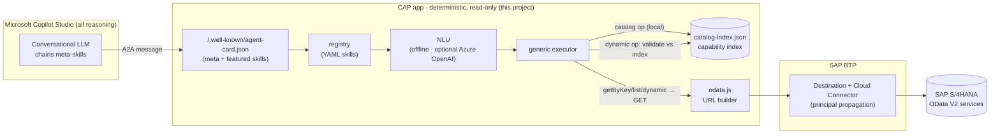
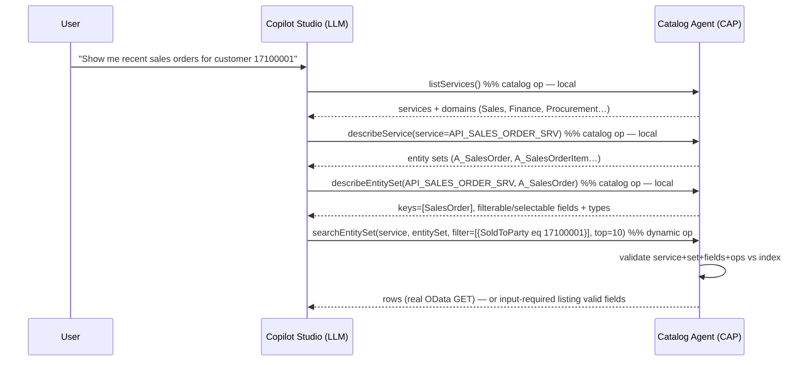

# 03 · SAP Catalog Agent — generic OData catalog agent

**One deterministic, read-only A2A agent that can front the *entire* OData catalog of *any* SAP
backend** — and be driven from **Microsoft Copilot Studio**.

Projects `01` and `02` expose a *hand-picked* set of skills (one YAML per business call). `03`
keeps the exact same engine but adds two new read-only backend operations and a small generation
pipeline so that **one agent covers a whole SAP system**: Copilot Studio discovers services and
entity sets at conversation time and queries them generically, while the CAP app stays a
deterministic OData V2 executor.

> **All reasoning and orchestration live in Microsoft Copilot Studio.** Any *optional*
> server-side parsing uses **Azure OpenAI** only (env-gated, with a silent deterministic
> fallback). **v1 is fully deterministic — Azure is never required.**

---

## What it is

A fork of the `02-a2a-cap-template` engine (registry → NLU → generic OData executor, driven by
declarative **skill YAML**, no per-skill code) with:

- **A capability index** (`srv/a2a/catalog-index.json`) — a curated, machine-readable map of
  `service → entitySet → { keys, properties(type, label, filterable, sortable, maxLength) }` plus
  each service's `domain`/`hub`/`namespace`. Generated once at build time from the backend's
  `$metadata`.
- **5 generic meta-skills** that let the LLM *discover then query* any indexed service.
- **8 curated featured skills** — ordinary static `getByKey`/`list` YAMLs over marquee entities
  (business partner, sales order, product, purchase order) so Copilot Studio has ready-made,
  copy-me examples.
- **Two new engine operations** — `catalog` (local index lookup, never touches SAP) and `dynamic`
  (runtime-parameterised OData GET, **validated against the index before any call**).

The existing `getByKey` / `list` operations are **byte-for-byte unchanged**, so featured skills and
anything inherited from `01`/`02` behave identically.

---

## Architecture



### The deterministic discovery → query chain

The meta-skill **descriptions are the only guidance the Copilot Studio LLM gets**, and they teach
this chain explicitly:



`describeEntitySet` is what makes generic access reliable: the LLM learns the **exact field names
and types** before it ever builds a filter, so it never guesses `CustomerID` when the field is
`SoldToParty`.

---

## The two new engine operations

Both are **read-only** and live on clearly separate branches of the one generic executor — no
per-skill code was added.

### `catalog` — local capability lookup (never calls SAP)

Powers `listServices`, `describeService`, `describeEntitySet`. The skill's `backend.view` selects
which index projection to return; runtime params (`serviceParam`, `entitySetParam`, `domainParam`)
filter it. The executor loads `srv/a2a/catalog-index.json` and answers **entirely locally** — it is
structurally impossible for a `catalog` skill to reach the backend.

### `dynamic` — index-validated runtime OData GET

Powers `searchEntitySet` (mode `list`) and `getByKey` (mode `getByKey`). The service, entity set,
key and filter all come from **runtime params**, and every one is checked against the capability
index **before any URL is built**:

- the requested `service` + `entitySet` must exist in the index;
- each filter/select **field** must be a real *filterable*/*selectable* property of that set;
- each filter **operator** must be one of `eq ne gt ge lt le`;
- `getByKey` **key fields** must match the set's declared keys (right count, right names);
- literals are typed from the property's EDM type in the index.

On any violation the agent returns an **`input-required`**-style message that lists the valid
options (services, sets, or field names) — and **does not call SAP**. Filters are only ever accepted
as a **structured array** of `{ field, op, value }` (never a raw `$filter` string, never
`substringof`) so there is no filter-injection surface. `$top` is capped, `$format=json` is always
added, and `$select` defaults to a narrow set derived from the index when the caller doesn't supply
one.

> **Security posture:** read-only (GET only, no writes / `$batch` / body); index-validated (unknown
> service, set, field, operator or key is rejected before any network call); curated (no customer
> `Z*` / `Y*` and no `UI`/obsolete services in the index); and all reasoning stays in Copilot
> Studio.

---

## Skills

### Meta-skills (hand-authored, generic — `srv/a2a/skills/meta-*.yaml`)

| id | operation | required params | purpose |
|----|-----------|-----------------|---------|
| `list-services` | `catalog` / `listServices` | — (`domain` optional) | Browse curated services + their domains. |
| `describe-service` | `catalog` / `describeService` | `service` | List a service's entity sets + one-line purposes. |
| `describe-entity-set` | `catalog` / `describeEntitySet` | `service`, `entitySet` | Return a set's keys + filterable/selectable fields with types + labels. |
| `search-entity-set` | `dynamic` / `list` | `service`, `entitySet` (`filter`, `top` optional) | List rows with an optional structured filter. |
| `get-by-key` | `dynamic` / `getByKey` | `service`, `entitySet`, `key` | Fetch one record by key. |

### Featured skills (generated static examples — `srv/a2a/skills/featured-*.yaml`)

Ordinary `getByKey` / `list` skills (no engine change) over marquee entities, so Copilot Studio has
concrete, working examples to imitate:

`featured-business-partner-get` · `featured-business-partner-list` ·
`featured-sales-order-get` · `featured-sales-order-list` ·
`featured-product-get` · `featured-product-list` ·
`featured-purchase-order-get` · `featured-purchase-order-list`

The Agent Card (`/.well-known/agent-card.json`) is named **`SAP Catalog Agent`**
(`protocolVersion 0.3.0`) and lists all 13 skills; its description teaches the discovery→query
chain.

---

## The generation pipeline

Three Node scripts under `scripts/` turn a backend's OData catalog into the index + featured skills.
They are **idempotent** and clearly separate generated files (banner header comment / `featured-*`
+ `catalog-index.json` names) from the hand-authored meta-skills.

| script | npm | what it does |
|--------|-----|--------------|
| `fetch-metadata.js` | `npm run fetch:metadata` | Pull the Gateway `ServiceCollection` + each service `$metadata`. Runs **offline by default** against a pre-fetched snapshot; `--live` opts into a real backend via the BTP destination. Writes raw output under `reference/`. |
| `gen-catalog.js` | `npm run gen:catalog` | **Curate** (see policy below) and emit a normalized `reference/catalog.curated.json` + human-readable `reference/catalog.curated.md`. |
| `gen-skills.js` | `npm run gen:skills` | Emit `srv/a2a/catalog-index.json` (the capability index) **and** the 8 `featured-*` skill YAMLs. |

`npm run gen:all` runs all three in order.

### Regenerating against a CUSTOMER's own SAP system (Windows PowerShell)

```powershell
cd 03-a2a-cap-catalog-agent

# 1. Point at the customer backend (BTP destination + Cloud Connector already wired).
Copy-Item .env.example .env
notepad .env    # set SAP_DESTINATION_NAME / URL / auth as in 01 & 02

# 2. Fetch their live catalog + $metadata (writes raw output under reference\).
npm run fetch:metadata -- --live

# 3. Curate. API_* public services are allow-listed; Z*/Y*, UI and obsolete are dropped.
#    Force-keep specific customer services with --allow:
npm run gen:catalog -- --allow ZCUSTOM_SRV,YSPECIAL_SRV

# 4. Regenerate the capability index + featured skills.
npm run gen:skills

# 5. Validate and smoke-test (see below), then commit the regenerated index + skills.
npm run validate:skills
npm run list:skills
node scripts\test-nlu.js
```

> The **offline default** exists purely so this repo builds with no live SAP. Against a real system
> you run the same commands with `--live` on step 2.

### Curation policy (P2.1)

`gen-catalog.js` classifies **every** service so the gate is demonstrable even on an all-`API_*`
snapshot:

- **KEEP** — public `API_*` services (allow-list `/^API_/`).
- **DROP** — `UI` services (name heuristic `*_UI` / `UI_*`).
- **DROP** — obsolete/deprecated (name contains `OBSOLETE` / `DEPRECATED`).
- **DROP** — customer namespace `Z*` / `Y*` (never published by default; override with `--allow`).
- **DROP** — anything not on the `API_*` allow-list.

**This snapshot:** `20` services in → `20` kept → `0` dropped (the bundled reference catalog is
already all-`API_*`), yielding **214 entity sets**. Domains: Sales 7, Procurement 7, Finance 5,
Procurement/Finance 1. A customer catalog with `Z*` / `UI` / obsolete services would see them logged
and excluded here.

---

## Run & validate (Windows PowerShell)

```powershell
cd 03-a2a-cap-catalog-agent
npm install                 # deterministic via package-lock.json

npm run validate:skills     # all 13 skills valid, unique ids, schema + *Param rules
npm run list:skills         # print id / name / operation for every skill
node scripts\test-nlu.js    # deterministic routing harness (9/9)

# Live-server smoke test
npm start                   # CAP server on http://localhost:4004
# in another terminal:
Invoke-RestMethod http://localhost:4004/.well-known/agent-card.json |
  Select-Object name, protocolVersion, @{n='skills';e={$_.skills.Count}}
# stop the server with Ctrl+C
```

---

## Deploy to Cloud Foundry & wire into Copilot Studio

Identical to `01` / `02` — the destination + Cloud Connector + principal-propagation chain is
reused unchanged.

```powershell
cd 03-a2a-cap-catalog-agent
npm install
mbt build                                   # produces mta_archives\*.mtar
cf login -a <CF_API> --sso
cf deploy mta_archives\a2a-cap-catalog-agent_0.1.0.mtar
```

Then in **Copilot Studio**: add an **Agent-to-Agent** connection pointing at the deployed
`/.well-known/agent-card.json`. The LLM will read the meta-skill descriptions and chain
`listServices → describeService → describeEntitySet → searchEntitySet / getByKey` on its own; the
featured skills give it concrete examples to imitate.

---

## Verify-TODO (no live SAP was reachable in this build)

The following need a real backend and are **not** verified here — do not assume they pass:

- **`dynamic` round-trips** — a real `searchEntitySet` / `getByKey` GET against a live service
  (offline validation of the index gate is covered; the actual OData response is not).
- **`fetch-metadata.js --live`** — live `ServiceCollection` + `$metadata` retrieval through the BTP
  destination. `$metadata` returns **XML**, and no XML parser dependency is bundled, so the `--live`
  metadata→index path needs a parser wired in and a real run to confirm.
- **End-to-end Copilot Studio** — the deployed card discovered by Studio and a full conversational
  chain exercised over SSO / principal propagation.
- **CF deploy** — `mbt build` + `cf deploy` of this specific project.

Everything else (schema, executor branches, index validation logic, curation gate, skill
validation, NLU routing, offline generation, agent-card shape) is verified above.

---

## Not in scope (future)

- **Runtime TTL refresh** of the capability index — build-time commit only for now (P2.2 hybrid). A
  clearly-marked hook/TODO is left in the generation code; no scheduler is built.
- **Write / action skills** — the agent is read-only by design.
